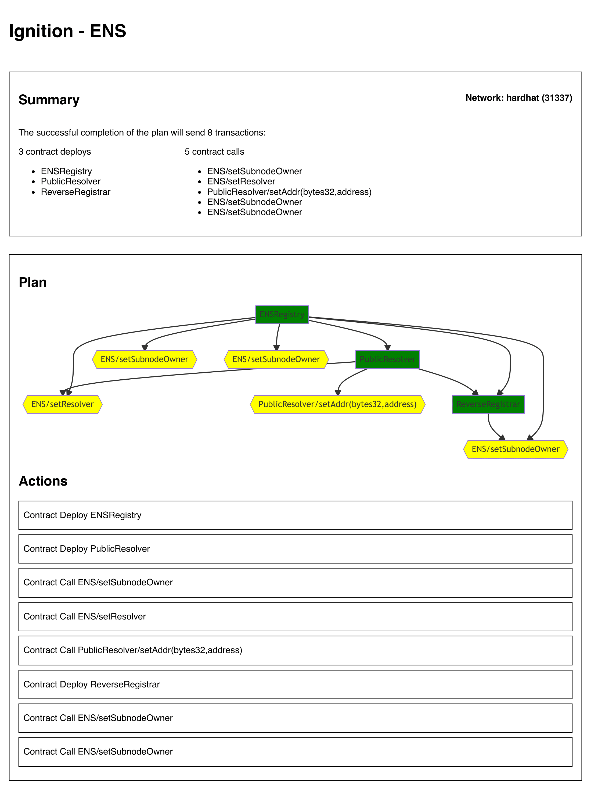
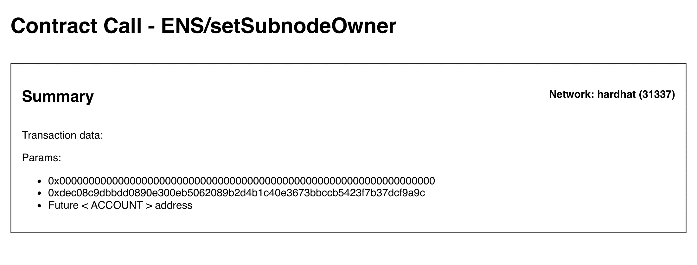

# Running a deployment

# Visualizing your deployment with the `plan` task

Within any **Ignition** project, you can use the `plan` task to gain a better understanding of how your deployment module connects together from one transaction to the next.

For example, using our [ENS example project](../examples/ens):

```bash
npx hardhat plan ENS.js
```

This task performs a "dry run" of the given deployment module and outputs a full HTML report that opens in your system's default browser:



At a glance, you can easily gain a visual reference for how many contract deploys and/or calls your deployment includes as well as a hierarchy for which transactions depend on which other transactions.

If something in your deployment isn't behaving the way you expected, the `plan` task can be an extremely helpful tool for debugging and verifying that you and your code are on the same page.

## Actions

To view more details about any given transaction, simply clicking on it will navigate you to a more detailed page:



Notice that, since this is just a dry run and not an actual deployment, any Futures passed as arguments will not have a resolved value yet. We include a placeholder for that data in the output above, and during an actual deployment that future will, of course, be replaced by the appropriate value.

## Resuming a failed or onhold deployment (TBD)

Currently, failed transactions will be retried a number of times, with an increasing gas price each time, up to a max retry limit. If it has failed past that point, the deployment is considered failed and will be stopped. But what happens if some transactions in the deployment had already succeeded?

Broadly speaking, if some part of the deployment fails, the user will be able to retry it, or to modify the failing action. With the help of an internal journaling service, successfully completed transactions would not be run a second time when resuming a partially failed deployment.

Similarly, a user with a deployment that is considered "on hold" and awaiting the completion of an external action of some kind (multisig wallet signatures, as an example) would be able to close the running **Ignition** process and resume the deployment safely whenever they choose without worrying about the previous actions being resolved again.

For non-development network deployments, this means some form of deployment freezing will be recommended that records relevant information such as contract abi, deployed address and network. These files will be recommended to be committed into project repositories as well.

The exact nature of these files is TBD as this feature is being developed.
